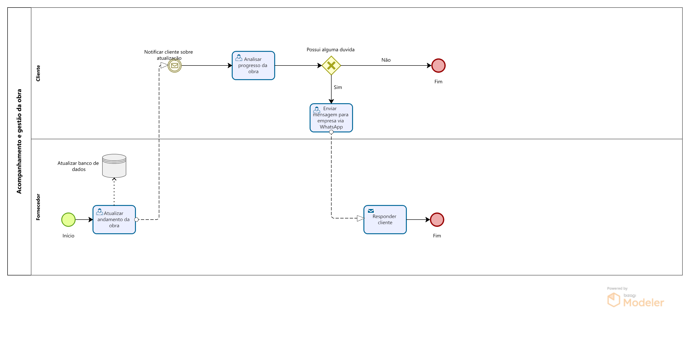

### 3.3.3 Processo 3 – Acompanhamento e gestão da obra

Nesse processo a empresa oferece ao seu cliente um possibilidade de acompanhamento da obra e o esclarecimento de dúvidas. Com a atualização sobre a progressão da obra pelo fornecedor, o cliente receberá uma notificação sobre novas informações adicionadas sobre a atividade. Após a análise do cliente acerca dos dados e caso apresente dúvidas sobre o andamento, o cliente conseguirá contatar a empresa pelo WhatsApp a empresa responsável pela obra irá responde-ló até que as incertezas sejam solucionadas.

#### Detalhamento das atividades

**Atualizar o andamento da obra** 
Fornecedor atualiza as informações sobre a obra e notifica o cliente.

**Analisar oo progresso da obra** 
O cliente faz a análise das atualizações feitas pelo fornecedor.

**Enviar mensagem para a empresa via WhatsApp** 
Caso o cliente possua alguma dúvida ele deve contactar a empresa.

**Responter cliente** 
O fornecedor esclareçe as dúvidas do cliente.

**Atualizar o andamento da obra**

| **Campo**       | **Tipo**         | **Restrições** | **Valor default** |
| ---             | ---              | ---            | ---               |
| Comentário      | Caixa de Texto   |                |                   |
| Imagem do Progresso | Anexo      |                |                   |
| Barra de progresso | Select        | Porcentagem    |                   |

| **Comandos**         |  **Destino**                   | **Tipo** |
| ---                  | ---                            | ---      |
| Enviar alterações    | Página de acesso do cliente    | Botão  |

**Analisar progresso da obra**

| **Campo**       | **Tipo**         | **Restrições** | **Valor default** |
| ---             | ---              | ---            | ---               |
| Comentário      | Caixa de texto   | Apenas visualização |              |
| Imagem do Progresso | Anexo      | Apenas visualização |              |
| Progresso | Select        | Apenas visualização |              |
| Data atualização | data        | Apenas visualização |              |
  
**Enviar mensagem via WhatsApp**

| **Comandos**         |  **Destino**                   | **Tipo** |
| ---                  | ---                            | ---      |
| Conversar com fornecedor | WhatsApp                   | Botão/link |

