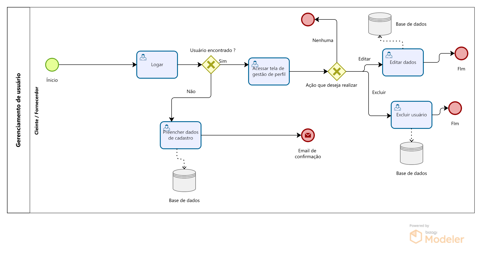

### 3.3.1 Processo 1 – Gerenciamento de fornecedor

O processo de gerenciamento de usuário tem como objetivo simplificar o processo de gestão de perfil do cliente e do fornecerdor. Durante esse processo, o fornecedor tem a capacidade de criar um perfil ou então logar para poder realizar qualquer alteração no perfil que deseja ser feita, como a alteração de algum dado cadastral, tal como  nome, senha ou nome da empresa e exlcuir o usuário caso deseje remove-ló.

#### Detalhamento das atividades

**Logar** 
Usuário preenche dados de login

**Preencher dados de cadastro** 
Usuário preenche os dados necessários para a realização do cadastro

**Acessar tela de gestão de perfil**  
O usuário acessa a tela de gestão de perfil

**Editar perfil** 
Caso tenha selecionado essa opção, o usuário edita os dados que deseja alterar do seu perfil

**Excluir usuário** 
Caso tenha selecionado essa opção, o usuário exclui seu perfil 
 
 

 
**Logar**

| **Campo**       | **Tipo**         | **Restrições** | **Valor default** |
| ---             | ---              | ---            | ---               |
| Email | Caixa de texto | formato de e-mail|                   |
| senha           | Caixa de Texto   | mínimo de 8 caracteres |           |

| **Comandos**         |  **Destino**                   | **Tipo** |
| ---                  | ---                            | ---               |
| logar               | Verificar dados digitados             | default     |
| Voltar                 | Usuário retorna para última tela                            |cancel               |

**Preencher dados de cadastro**

| **Campo**       | **Tipo**         | **Restrições** | **Valor default** |
| ---             | ---              | ---            | ---               |
| Nome fornecedor |Caixa de texto  |     |                   |
| CNPJ| Caixa de texto |Formato CNPj de 14 dígitos  |      |
| Endereço| Caixa de texto | Endereço completo |      |
| Email | Caixa de texto | Formato de email |      |
| Senha| Caixa de texto | Mínimo 8 dígitos |      |
| Confirmar senha| Caixa de texto | Ser igual a senha |      |

| **Comandos**         |  **Destino**                   | **Tipo**          |
| ---                  | ---                            | ---               |
| Cadastrar | Validar dados do cadastro | default |
| voltar | Sair da tela de cadastro | cancel |

**Acessar tela de gestão de perfil**

| **Comandos**         |  **Destino**                   | **Tipo**          |
| ---                  | ---                            | ---               |
| Ir para tela de gestão de perfil|Tela de gestão de perfil | default |

**Editar dados**

| **Campo**       | **Tipo**         | **Restrições** | **Valor default** |
| ---             | ---              | ---            | ---               |
| Nome da empresa|Caixa de texto  |     |                   |
| CNPJ| Caixa de texto |Formato CNPj de 14 dígitos  |      |
| Endereço| Caixa de texto | Endereço completo |      |
| Email | Caixa de texto | Formato de email |      |
| Senha| Caixa de texto | Mínimo 8 dígitos |      |
| Confirmar senha| Caixa de texto | Ser igual a senha |      |

| **Comandos**         |  **Destino**                   | **Tipo**          |
| ---                  | ---                            | ---               |
| Selecionar campo que deseja alterar| Seleção do dado que será alterado | default |
| Confirmar edição| Validar alterações do perfil | default |
| voltar | Sair da tela de edição de cadastro | cancel |

**Excluir usuário**

| **Comandos**         |  **Destino**                   | **Tipo**          |
| ---                  | ---                            | ---               |
| Excluir usuário| Abrir confirmação de ação | default |
| Confimar exclusão| Confimar exclusão do perfil | default |
| voltar | Sair da tela de edição de cadastro | cancel |

