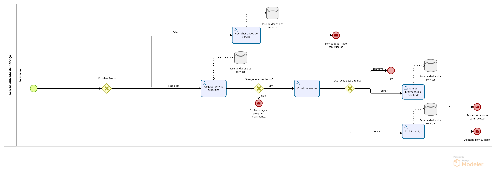

### 3.3.2 Processo 2 – GERENCIAMENTO DOS SERVIÇOS

O Processo de gerir os serviços pode ser melhorado ao disponibilizar ao fornecedor um só lugar onde é permitido efetuar o controle de todos os serviços que podem ser oferecidos em uma obra, esse controle consiste em 4 etapas, cadastro de um novo serviço no catálogo, , vizualização dos serviços existentes, edição de serviços previamente cadastrados e por fim a exclusão.

#### Detalhamento das atividades

**Preencher dados do serviço**:  
Fornecedor preenche um formulário contendo todos os dados que o serviço oferecido contém, por exemplo o que será feito e como será a forma de calcular o preço.

**Pesquisar serviço específico**:  
O fornecedor pesquisa um serviço que já está cadastrado no sisetma por meio do nome do serviço ou seu id.

**Visualizar serviço**:  
O fornecedor consegue visualizar um seviço já cadastrado e todos os seus detalhes.

**Alterar informações já cadastradas**:  
O fornecedor caso necessite de fazer uma alteração em um serviço, nessa atividade é possível mudar todos os campos do serviço que já foram cadastrados anteriormente.

 **Preencher dados do serviço**

| **Campo**      | **Tipo**         | **Restrições**       | **Valor default** |
|----------------|------------------|----------------------|-------------------|
| Nome do Serviço| Caixa de Texto   | Até 32 caracteres    |                   |
| Preço          | Numérico         |                      |                   |
| Unidade de Medida | Seleção Única | Seleção Única        |                   |
| Descrição | Área de Texto         |                      |                   |

 **Comandos**

| **Comando**           | **Destino**                    | **Tipo**    |
|-----------------------|---------------------------------|-------------|
| Confirmar Cadastro    | Fim do processo de criação      | cancel      |

 **Pesquisar serviço específico**

| **Campo**             | **Tipo**         | **Restrições**                        | **Valor default** |
|-----------------------|------------------|---------------------------------------|-------------------|
| Nome do serviço | Caixa de Texto         | Até 32 caracteres               |                   |
| Id do serviço   | Numérico               |                                 |                   |
| Preço           | Numérico               |                                 |                   |
| Unidade de Medida | Seleção Única        | Seleção única                   |                   | 

 **Comandos** 

| **Comando**           | **Destino**                        | **Tipo**    |
|-----------------------|-------------------------------------|-------------|
| Pesquisar             | Direciona para tela de vizualização | cancel      |

**Visualizar serviço**

| **Campo**                  | **Tipo**         | **Restrições**                       | **Valor default**  |
|----------------------------|------------------|--------------------------------------|--------------------|
| Nome do Serviço             | Caixa de Texto            | Somente leitura                      | Nome preenchido    |
| Preço          | Numérico         |                      |                   |
| Descrição              | Caixa de Texto            | Somente leitura                      | Descrição preenchida    |
| Unidade de Medida | Seleção Única | Seleção Única        |                   |
| Fornecedor                | Texto            | Somente leitura                      | Responsável |

**Comandos** 

| **Comando**                 | **Destino**                   | **Tipo**               |
|-----------------------------|-------------------------------|------------------------|
| Voltar |  Tela inicial      |   Cancel            |

**Alterar informações já cadastradas**

| **Campo**                  | **Tipo**        | **Restrições**                      | **Valor default**  |
|----------------------------|-----------------|-------------------------------------|--------------------|
| Nome do Serviço             | Texto          |                      |                   |
| Preço                       | Numérico       |                      |                   |
| Unidade de Medida           | Seleção Única  | Seleção Única        |                   |
| Descrição                   | Área de Texto  |                      |                   |

**Comandos** 

| **Comando**                 | **Destino**                   | **Tipo**               |
|-----------------------------|-------------------------------|------------------------|
| Alterar informações         | Selação dos dados que serão alterados  | Botão                  |
| Confirmar alterações | Tela inicial                | Botão                  |

**Excluir serviço**

| **Comandos**         |  **Destino**                   | **Tipo**          |
| ---                  | ---                            | ---               |
| Excluir | Abrir confirmação de ação | default |
| Confimar exclusão| Confimar exclusão do perfil | default |
| voltar | Sair da tela de gerenciamento de serviço | cancel |
