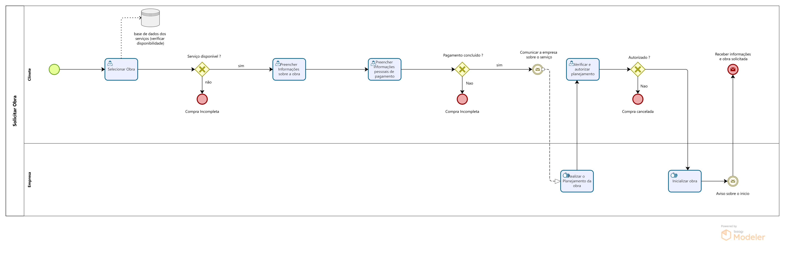

### 3.3.4 Processo 4 – SOLICITAR OBRA

No processo de solicitação de obra, o cliente poderá selecionar o serviço que melhor atenda às suas necessidades. Em seguida, preencherá um formulário detalhado com as informações relevantes, como as dimensões e outros aspectos essenciais para a execução da obra. Após a confirmação do pagamento, a empresa iniciará o planejamento, notificando o cliente sobre a data de início dos trabalhos. A partir desse momento, o processo de compra será finalizado e a obra será executada conforme o planejamento.

#### Detalhamento das atividades

**Selecionar Obra** 
Cliente escolhe qual obra deseja.

**Preencher Informações sobre a obra** 
Cliente deverá informar as informações sobre a obra, como por exemplo as dimensões ou alguma restrição que possa existir na obra.

**Preencher Informações pessoais de pagamento** 
O cliente irá preencher suas informações pessoais de pagamento e realizar o pagamento.

**Realizar o Planejamento da Obra** 
A empresa realizará manualmente o planejamento, para que o cliente saiba como será a obra.

**Verificar e autorizar planejamento** 
O cliente terpa acesso a todas as informações da obra e o planejamento realizado pela empresa, concordando ou não com o planejamento proposto.

**Inicializar Obra** 
A empresa dá inicío as obras e é realizado um envio de mensagem de íncio da obra.

**Fim** 
O processo termina com o cliente adiquirindo a nova obra.

 **Selecionar Obra**

| **Campo**      | **Tipo**         | **Restrições**       | **Valor default** |
|----------------|------------------|----------------------|-------------------|
| Selecionar Obra        | Botão de seleção  | Seleção única        |                   |

 **Comandos**

| **Comando**           | **Destino**                    | **Tipo**    |
|-----------------------|---------------------------------|-------------|
| Confirmar Seleção     | Direciona para Informações da Obra | default     |
| Cancelar              | Retorna para última tela         | cancel      |

 **Tela de Informações da Obra**

| **Campo**             | **Tipo**         | **Restrições**                        | **Valor default** |
|-----------------------|------------------|---------------------------------------|-------------------|
| Data de Início | Campo de Data    | Data válida no formato DD/MM/AAAA     |                   |
| Área a ser Construída | Seleção Única    | Seleção Única     |                   |
| Endereço   | Caixa de Texto   | Mínimo de 10 caracteres               |                   |
| Observação do cliente  | Caixa de Texto grande  | Mínimo de 20 caracteres               |                   | 

 **Comandos** 

| **Comando**           | **Destino**                        | **Tipo**    |
|-----------------------|-------------------------------------|-------------|
| Cancelar              | Usuário retorna para última tela    | cancel      |
| Avançar para Pagamento| Direcionar para tela de pagamento   | default     |

**Informações Pessoais de Pagamento**

| **Campo**               | **Tipo**           | **Restrições**                       | **Valor default** |
|-------------------------|--------------------|--------------------------------------|-------------------|
| Número do Cartão         | Caixa de Texto     | Obrigatório, 16 dígitos              |                   |
| Nome no Cartão           | Caixa de Texto     | Obrigatório, como no cartão          |                   |
| Validade do Cartão       | Caixa de Texto     | Mês/ano (MM/AA)                      |                   |
| CVV                      | Caixa de Texto     | Obrigatório, 3 dígitos               |                   |

 **Comandos**

| **Comando**             | **Destino**                         | **Tipo**    |
|-------------------------|--------------------------------------|-------------|
| Concluir Pagamento       | Finaliza e processa o pagamento      | default     |
| Cancelar                | Retorna para última tela sem pagar   | cancel      |

**Verificação e Autorização do Planejamento**

| **Campo**                  | **Tipo**         | **Restrições**                       | **Valor default**  |
|----------------------------|------------------|--------------------------------------|--------------------|
| Nome da Obra             | Texto            | Somente leitura                      | Nome preenchido    |
| Área Construída             | Texto            | Somente leitura                      | Área preenchida    |
| Data Início     | Texto            | Somente leitura                      | Data preenchida    |
| Data Término    | Texto            | Somente leitura                      | Data preenchida    |
| Endereço                 | Texto            | Somente leitura                      | Localização        |
|Detalhes Relevantes  | Texto            | Somente leitura                      | Detalhes preenchidos|
| Observações do Cliente      | Caixa de Texto   | Opcional                             |                    |

**Comandos** 

| **Comando**                 | **Destino**                   | **Tipo**               |
|-----------------------------|-------------------------------|------------------------|
| Aceitar Planejamento         | Confirmar compra e finalizar  | Botão                  |
| Recusar e Retornar à Tela Inicial | Tela inicial                | Botão                  |

